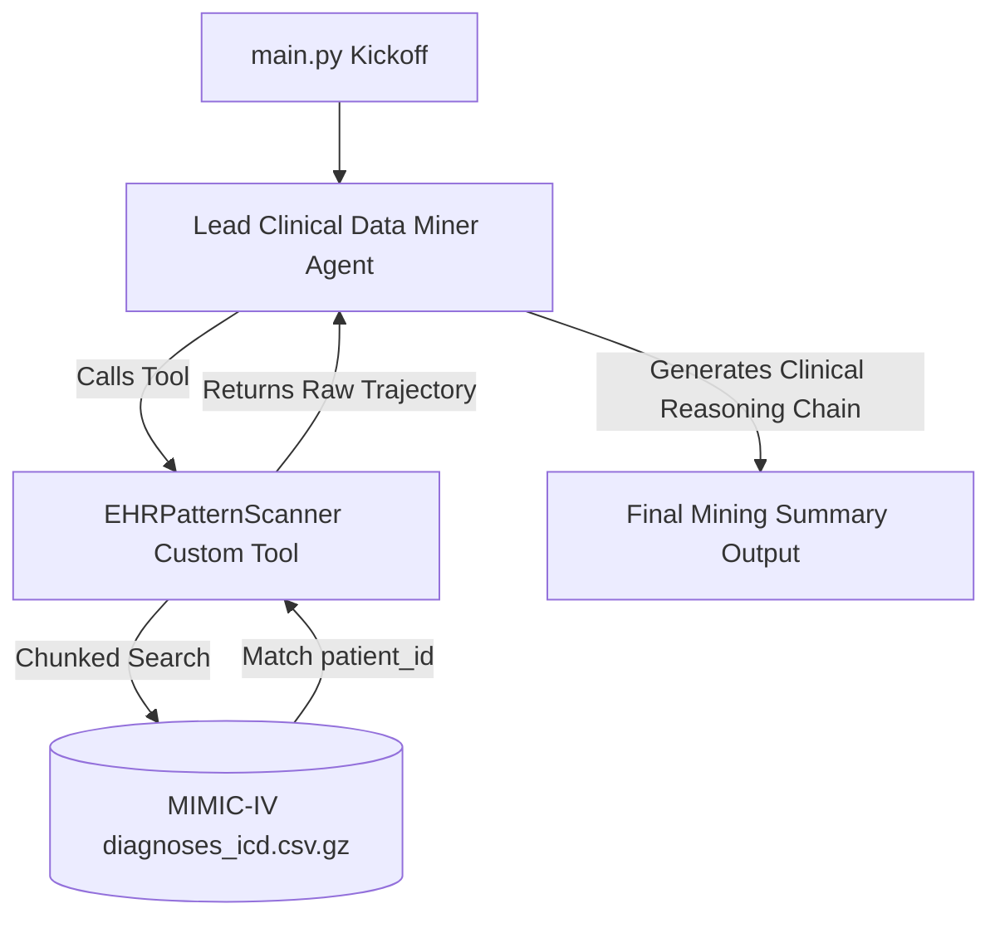

# Multi-Agent Clinical Trajectory Miner & Auditor 🚀

A high-performance, multi-agent artificial intelligence framework powered by **CrewAI** and **Google Gemini** (via `gemini-2.5-flash-lite`). This system is designed to securely and efficiently scan large-scale Electronic Health Records (EHR) in the **MIMIC-IV** clinical database to mine patient medical trajectories, track vital diagnosis codes, and audit potential sepsis triggers.

---

## 📌 Project Goals
1. **Clinical Sequence Mining:** Automatically traverse massive longitudinal patient histories to reconstruct structured patient trajectories.
2. **Sepsis Pattern Recognition:** Identify early warning signs and sequential physiological triggers (such as respiratory distress or circulatory failure) associated with sepsis.
3. **Memory-Safe Local Processing:** Provide an efficient, low-memory chunk-based scanning pipeline for parsing heavily compressed gzipped MIMIC-IV data files without memory overflow.
4. **Hybrid Flexibility:** Design a seamless developer experience that runs perfectly on a local workstation or easily integrates into a Google Colab notebook.

---

## ⚙️ Architecture Workflow

The system coordinates specialized intelligence agents and local processing tools to safely extract insights:



---

## 🛠️ Quick Start & Setup Guide

Follow these steps to set up and run the clinical auditor on your local machine.

### 📋 Prerequisites
- **Python:** Version 3.10 to 3.12 is recommended.
- **Gemini API Key:** A valid Google Gemini API key.

---

### Step 1: Create and Activate your Virtual Environment
To keep your global environment clean, use the standard Python virtual environment tool:

```bash
# Create a virtual environment named 'venv'
python -m venv venv

# Activate the environment:
# On Windows (PowerShell):
.\venv\Scripts\Activate.ps1

# On Windows (CMD):
.\venv\Scripts\activate.bat

# On macOS/Linux:
source venv/bin/activate
```

---

### Step 2: Install Dependencies
With the virtual environment activated, install the required packages:

```bash
pip install -r requirements.txt
```

---

### Step 3: Configure Environment Variables
1. Duplicate the template file to create your active environment configuration:
   ```bash
   copy .env.template .env
   ```
2. Open the new `.env` file and insert your Gemini API Key:
   ```env
   GEMINI_API_KEY=your_actual_api_key_here
   ```

> [!NOTE]
> The system automatically loads your `.env` configuration file on startup using `python-dotenv`.

---

### Step 4: Place the Clinical Database (MIMIC-IV)
The system is built to ingest the standard **MIMIC-IV Clinical Database Demo**. 

1. Create a `data/` folder in your project root.
2. Place the `mimic-iv-clinical-database-demo-2.2.zip` archive into the `data/` directory.
3. Unzip the file. The unzipped folder structure must match this path:
   `./data/mimic-iv-clinical-database-demo-2.2/hosp/diagnoses_icd.csv.gz`

> [!IMPORTANT]
> The `.gitignore` is pre-configured to ignore all `data/` directories, `.zip` files, and `.csv.gz` datasets. You can safely store large files locally without accidentally committing them to GitHub.

#### 💡 Hybrid Drive/Cloud Setup (Optional)
If you or your professor prefer to run the system in a Google Colab notebook connected to Google Drive, do not change any source code. Simply add the `CLINICAL_DATA_PATH` variable to your `.env` file pointing to the Colab path:
```env
CLINICAL_DATA_PATH=/content/drive/MyDrive/clinical_data_storage/mimic-iv-clinical-database-demo-2.2/hosp/diagnoses_icd.csv.gz
```

---

### Step 5: Run the Project!
Run the main pipeline to scan patient trajectory records and trigger the AI agent:

```bash
python main.py
```

---

## 🧪 Testing Different Patient Records
To audit or mine clinical trajectories for a different patient, simply check the list of available patient IDs in the extracted dataset:
📄 [data/mimic-iv-clinical-database-demo-2.2/demo_subject_id.csv](file:///c:/Users/emili/Multi-Agent-Clinical-Auditor/data/mimic-iv-clinical-database-demo-2.2/demo_subject_id.csv)

Open [main.py](file:///c:/Users/emili/Multi-Agent-Clinical-Auditor/main.py) and update the `patient_id` inside the task description (e.g., changing `'10000032'` to `'10001217'`):

```python
# In main.py
mining_task = Task(
    description="Scan the history for patient '10001217'. Find all diagnosis codes and timestamps.",
    expected_output="A structured summary of the patient's clinical trajectory.",
    agent=diagnostician
)
```

---

## 🔒 Security & Privacy (HIPAA compliance)
- **Zero Raw Data Exposure:** The AI agent only receives the extracted text snippet of the specific matched patient ID. The entire database is parsed locally and is never sent to any external server.
- **Sensitive files Ignored:** All local database records, raw CSVs, large zip archives, and private keys (`.env`) are strictly excluded in [.gitignore](file:///c:/Users/emili/Multi-Agent-Clinical-Auditor/.gitignore).